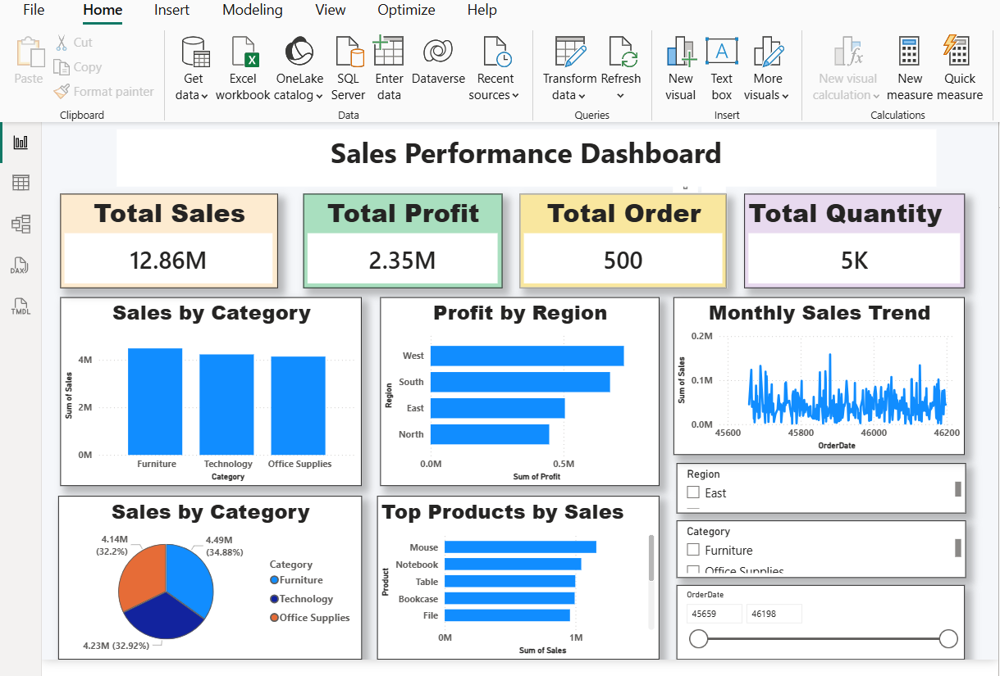

# Sales Performance Dashboard (Power BI)

## Project Overview
This project is an interactive Sales Performance Dashboard developed in Power BI using an Excel dataset. The dashboard helps analyze sales performance through KPIs, charts, and interactive filters.

## Tools Used
- Power BI
- Microsoft Excel

## Dashboard Features
- KPI Cards
  - Total Sales
  - Total Profit
  - Total Orders
  - Total Quantity

- Interactive Slicers
  - Region
  - Category
  - Order Date

- Charts
  - Sales by Category
  - Profit by Region
  - Monthly Sales Trend
  - Top Products by Sales
  - Sales by Category (Pie Chart)

## Skills
- Data Cleaning
- Data Visualization
- Dashboard Design
- Business Reporting

## 📷 Dashboard Preview

